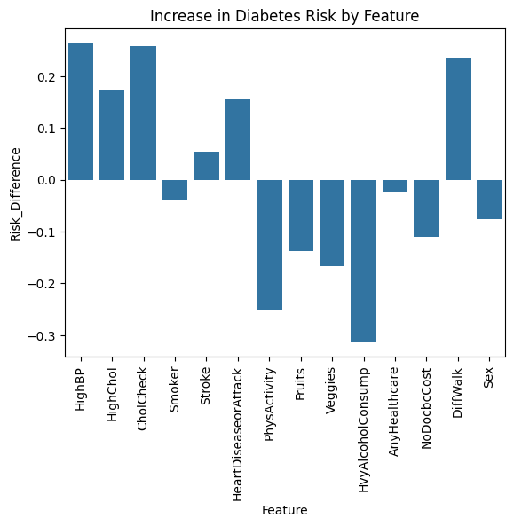
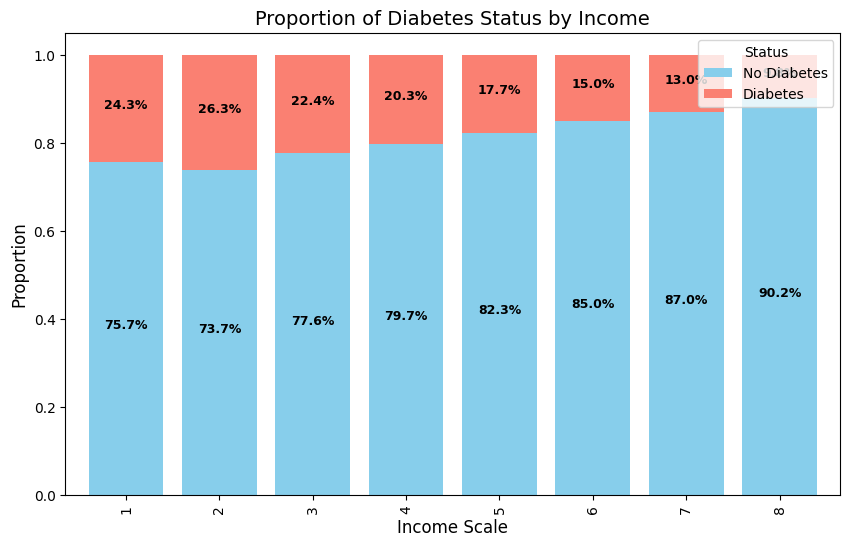
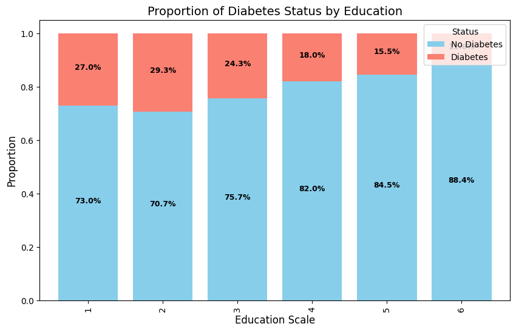
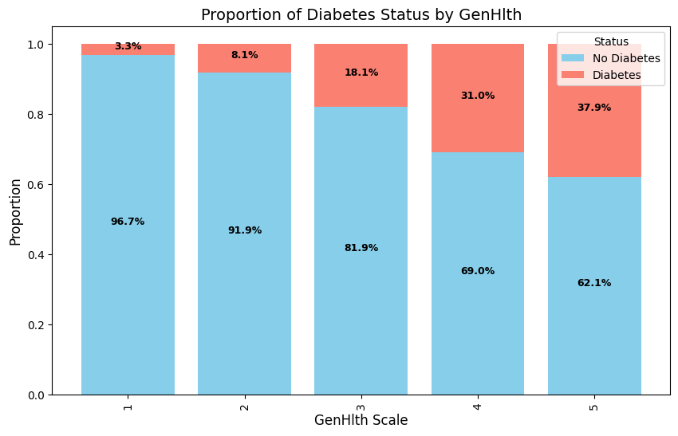
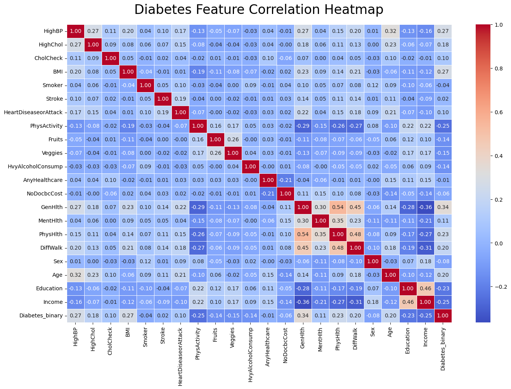
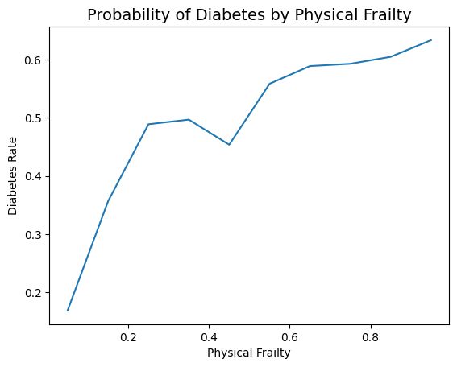

# Diabetes Predictor Final Report

## Business Understanding and Problem Statement
Diabetes is a condition that can cause severe health and lifestyle complications if it's not detected early. The goal is to build a machine learning model that helps predict whether individuals are likely to have or be at risk for diabetes using health metrics such as BMI, general health, and other lifestyle and health factors.

A challenge that is present in this problem is that the classes between diabetic and non-diabetic individuals are imbalanced since around 11.1% of adults have diabetes as of 2025 [[1]](#1). Because of this imbalance, modeling on this data will most likely contain bias towards the majority--people without diabetes. Additionally, there are some features in the dataset I plan to use that contain self-reported indicators that may or may not introduce some noise or outliers such as general health, where individuals describe their general health on a scale of 1-5, 1 being the best and 5 being the worst.

By addressing this problem, we can match the health factors and lifestyle patterns in individuals with those with diabetes and identify whether they are at high risk or already have diabetes or not. It's important to investigate because it helps experts walk with more confidence when diagnosing patients. It can also possibly help experts catch signs of diabetes early on and help prevent patients from getting diabetes. If this problem is left uninvestigated, there will be a lot of people who are unaware that parts of their daily habit pose a risk to them developing diabetes. Leaving this problem unanswered will remove people’s ability to take action to prevent this from happening. It can also leave people with a heavy burden of having to manage their daily sugar intake and possibly cause more frequent medical visits. By performing this analysis, it’ll help individuals by informing them of the most common risk factors and allow them to perform an analysis on their daily lives to reduce said risks to prevent diabetes. It also helps medical professionals perform a more educated diagnosis on their patients, allowing them to prioritize those with higher risks of getting diabetes.

## Model Predictions

Since we're trying to determine whether a person has, or is at risk of diabetes or not, this is a classification problem. By the end of this project, I expect my model to be able to successfully return a binary decision, indicating whether a person has--or is at risk of--diabetes, or no diabetes. 

## Data Acquisition and Exploratory Data Analysis
The data I plan to use to train my models is the UC Irvine CDC Diabetes Health Indicators dataset [[2]](#2). It was funded by the Centers for Disease Control and Prevention (CDC). It contains numerous health indicators, such as high blood pressure and high cholesterol, as well as lifestyle factors, such as the amount of physical activity and whether the individual is a smoker. It also includes demographics and personal information, such as sex, income, and education.

Below shows a bar graph, plotting all available binary features and their risk difference (risk of diabetes with this feature - risk of diabetes without this feature)

From the plot above, we can see that people with high blood pressure and high cholesterol both have around a 15-17% increased risk of getting diabetes. In terms of medical history and lifestyle, people who have had a stroke, heart disease, heart attack, and people who have difficulty walking all have around a 17-20% increased risk in getting diabetes. On the other hand, those who have participated in physical activity and those who don't consume heavy amounts of alcohol actually have around a 10% decreased risk in getting diabetes. This clearly shows that there are definitely some factors that contribute to the likelihood of an individual getting diabetes.

Below are the stacked bar charts for income, education, and general health features. For context, on the income feature scale, the higher the number, the higher the income, ranging from less than $10,000 a year to $75,000 or more a year. For education, the higher the number, the higher the education, ranging from never attended school / kindergarden to college graduate. For general health, 1 means the individual believes their general health is very healthy whilst 5 means they believe they are very unhealthy.

There are some clear trends when observing these plots. A larger proportion of those with a lower annual income seem to have diabetes. Similarly, those with less education also seem to have a larger proportion in which individuals have diabetes. This could be possibly due to the correlation between education and income. Individuals who have a lower income will more likely not have as much access to healthier foods, which are typically more expensive, as well as healthcare, which could allow people to monitor their health. For general health, as expected, there's a large proportion of people with diabetes who perceive their overall health to be poor, with 37.9% of participants who rated their general health as a 5 ended up having diabetes.

In addition to the original features, I've feature engineered some new columns to showcase the impact between different metrics with high correlation, illustrated in the heatmap shown below. In addition, below is an example of a plot between an engineered column, physical frailty, which combines general health, difficulty walking, and physical health.

The left end of the spectrum represents individuals who have excellent general health, have no difficulty walking, and have had no bad physical health days. On the other end, the right end of the x-axis represents individuals who have poor general health, have difficulty walking, and have had 30 days of poor physical health. As depicted in the graph above, the more physically frail an individual is, the higher the risk of getting diabetes, going all the way up to around 36% increased risk.

After visualizing the relationship between the features in this dataset with the target variable, as well as the correlation between the features themselves, it's clear that there are some patterns that can be utilized to determine whether a person probably has or is at risk of diabetes or not.

## Data Preprocessing / Preparation

To process and prepare the data for future modeling, I first looked for any missing or duplicate data. As mentioned on the data source's website and through my analysis, it's confirmed that there are no missing data or duplicate samples in the dataset.

Before splitting the data into training and testing sets, I decided to feature engineer some new columns to help my models identify the patterns more easily. Using the correlation heatmap shown above and my domain knowledge, I created 4 new features that I believe would assist during training.

The first column is ***Total_Unhealthy_Days***, which represents the total amount of an individual's mental and physical ill-being. The thought here is that the more mentally and physically stressed a person is, the higher likelihood of that person developing poor behavior and dietary habits, which in turn, can affect glucose and blood sugar levels. The second is ***Lifestyle_Risk***, which measures lifestyle behaviors, like smoking habits, healthcare access, and physical activity, together to see if the combination of them can increase the risk of diabetes. If a person smokes and doesn't participate in any physical activity, they are subsequently increasing their insulin resistance and blood sugar levels, both of which are direct symptoms and causes of diabetes. The third feature is ***Physical_Frailty***, which, as described above, combines general health, difficulty walking, and physical health to encapsulate a person's frailty. A person who is physically weaker has an increased risk due to the body's decreased metabolic functions, which consequently can lead to diabetes. The final feature is ***BMI_Inactive***, which combines a person's BMI and their physical activity. If a person's BMI is higher AND they aren't doing any physical activity to keep their bodily functions healthy, it's expected to increase the risk since the individual's overall health will most likely decrease as this behavior continues.

After developing some new features, I split the data into an 80-20 train-test split in order to give sufficient data for the models to both train and test on.

Finally, I standardized all the features using a standard scalar to prevent any scaled features like BMI to dominate the binary features.

## Modeling

Since this dataset contains imbalanced classes (most samples are labeled as non-diabetic) I need to use a model that performs well with imbalanced data such as decision trees, make the majority class hold less weight by adding class weights to models such as logistic regression and SVM, and add synthetic samples by applying SMOTE (Synthetic Minority Over-sampling Technique), which allows me to create fake but educated samples to help balance out the classes. By applying SMOTE, I’d be able to experiment with different models without having to worry about the class imbalance affecting or skewing the results of the model during training and testing. 

## Model Evaluation

Because there's a significant difference between a false positive and a false negative in this binary classification problem, I gauged performance by F1 scores and precision-recall instead of accuracy. The goal of all models is to minimize the amount of false negatives (predicting non-diabetic when they actually are or are at risk) whilst maximizing the amount of true positives (predicting diabetic when they actually are) and true negatives (predicting non-diabetic when they actually aren't).

### Baseline Model

Starting off with the baseline model, which is just a logistic regression model with default parameters training on the original samples--the data contains the new features but SMOTE was not applied, so it's being trained on the imbalanced data. The cross-validation score for this baseline model was around 0.8062. After training and retrieving the classification report and confusion matrix, it returned with the following scores:

**Classification Report:**
| diabetes? | precision | recall | f1-score |
| :-------: | :-------: | :----: | :------: |
| 0         | 0.86      | 0.98   | 0.92     |
| 1         | 0.54      | 0.15   | 0.24     |

**Confusion Matrix:**
|               | Predicted: 0 | Predicted: 1 |
| :------------ | :----------: | :----------: |
| **Actual: 0** | 37995 (TN)   | 921 (FP)     |
| **Actual: 1** | 5940 (FN)    | 1079 (TN)    |

Overall, this seems like a good start if you're looking solely on the cross-validation score. But after analyzing the reports, it reveals that this model actually performs extremely poorly when it comes to detecting diabetes, indicated by a recall score of 0.15 and a false negative rate of ~84.6%. This poor prediction rate is most likely due to the imbalanced classes. There wasn't enough data on diabetic participants, so it formed a bias towards non-diabetic samples.

### * Future Model Evaluations TBD *

## Conclusion

While analyzing the results, it seems like many health metrics like blood pressure and cholesterol are very good indicators for diabetes. In terms of an individual's lifestyle behavior, those who have difficult walking, have low amounts of physical activity and heavy alcohol consumption are more likely to be diagnosed with diabetes due to the reduced bodily functions it causes. Furthermore, a combination of these behaviors seems to increase the risk even more, such that those with a generally unhealthy lifestyle tend to develop diabetes more often than those who take care of their physical health. Moving onto another category, the medical history of an individual, like a previous stroke, heart disease, or heart attack, also seems to significantly affect a person's chance to be diagnosed with diabetes. This already indicates that the person's body is struggling with higher blood pressure and lower cardiovascular health, which means they either already have diabetes or are at a very high risk of getting it. On the other hand, it seems like there are features that are dependent on other factors, such as BMI. Although people with a higher BMI are more likely to have diabetes, if that person is maintaining a healthy lifestyle such as exercising, not smoking or drinking, and eating healthy, their chances of being diagnosed with diabetes actually can drop.

Being able to successfully predict whether an individual has or is at risk of diabetes just based on simple health metrics, history, and lifestyle behaviors can significantly help doctors and other medical professionals identify and flag high risk patients, allowing them to prioritize those who are in more danger of contracting diabetes. It can also help the patient themselves. By pinpointing the vulnerability that's making them more at risk of getting diabetes, they can work towards trying to improve or get better in order to lower their risk. By doing both of these things, it could prevent severe medical procedures and complications like amputation, kidney failure, and vision loss, which helps save a lot of money while also preserving the individual's well-being. Practically, this model could also be integrated in a health application where users can input specific features and metrics and it can provide an accurate prediction as to whether the person is at risk of getting diabetes or not. In addition, it can give on-demand recommendations on how to reduce the risk whilst providing users with sources for specific remedies to certain risk factors.

Diabetes is an extremely expensive and life-costing chronic medical disease that affects millions of people. By analyzing and identifying key risk factors, allowing medical professionals to flag high-risk patients, and informing users about their chances of getting diabetes and providing them a clear opportunity to lower that risk through apps, we can hopefully decrease the percentage of diabetic people around the world.

## Sources
<a id="1">[1]</a> International Diabetes Federation. (2021). *IDF Diabetes Atlas*. https://idf.org/about-diabetes/diabetes-facts-figures/

<a id="2">[2]</a> CDC. (2017). *CDC Diabetes Health Indicators* [Dataset]. UCI Machine Learning Repository. [https://doi.org/10.24432/C53919](https://doi.org/10.24432/C53919)
