# Diabetes Predictor Final Report

## Relevant Links
- [Capstone Report](Capstone_Report.pdf)

- [Notebook](capstone.ipynb)

- [Dataset](https://doi.org/10.24432/C53919)

## Business Understanding and Problem Statement
There are two different types of diabetes, both with similar but different effects on one’s body. Type 1 Diabetes is an autoimmune disease where your body is unable to produce any insulin, which allows a person’s body to use sugar for energy. Type 2 Diabetes is typically caused through lifestyle decisions, resulting in the body building resistance to insulin. Nonetheless, diabetes is a condition that occurs when a person’s glucose or blood sugar levels are too high, which can cause severe health and lifestyle complications if it's not detected early. According to the National Institute of Diabetes and Digestive and Kidney Diseases, some symptoms can include increased thirst and urination, fatigue, unexpected weight loss, and blurry vision. Some people can exhibit other symptoms and some may not exhibit any symptoms, leading to many individuals unaware that they even have diabetes.

Due to this typical lack of symptoms, it can be difficult to determine whether or not an individual has diabetes or not without performing any blood tests. This can be quite expensive for both the patient, due to the cost of the tests, and the hospital, through the use of medical equipment. In addition, doctors may be taking up time testing and treating patients who have a low likelihood of having diabetes when they could be prioritizing other patients who are at higher risk. Being able to predict whether a person is at risk of diabetes would significantly help patients catch common signs that lead to diabetes earlier and change their lifestyle accordingly to reduce their risk, helping prevent type 2 diabetes. In addition, it would help doctors easily identify and treat high-risk patients with more confidence.

The goal is to build a machine learning model that helps predict whether an individual is likely to have or be at risk of diabetes using health and lifestyle metrics such as BMI, general health assessments, and other behavioral factors, such as amount of physical activity.

A challenge present in this problem is that the number of diabetic and non-diabetic individuals will be imbalanced, since around 11.1\% of adults have diabetes by 2025 [[1]](#1). Because of this imbalance, modeling on this data will most likely contain bias towards the majority--people without diabetes. Additionally, in the dataset I plan to use, there are some features that contain self-reported indicators that may or may not introduce some noise or outliers such as general health, where individuals describe their general health on a scale of 1-5, 1 being the best and 5 being the worst.

By addressing this problem, we can match the health factors and lifestyle patterns in individuals with those with diabetes and identify whether they are at high risk or already have diabetes or not. It's important to investigate because it helps experts walk with more confidence when diagnosing patients. It can also possibly help experts catch signs of diabetes early on and help prevent patients from getting diabetes. If this problem is left uninvestigated, there will be a lot of people who are unaware that parts of their daily habit pose a risk to them developing diabetes. It can also remove people’s ability to take action to prevent this from happening. As a result, it could leave people with a heavy burden of having to manage their daily sugar intake and possibly cause more frequent medical visits. By performing this analysis, it’ll assist individuals by informing them of the most common risk factors and allow them to perform a self-analysis on their daily lives and reduce said risks. It also helps medical professionals perform a more educated diagnosis on their patients, allowing them to prioritize those with higher risks of getting diabetes.

## Model Predictions

The problem that this model aims to solve is a classification problem using supervised learning algorithms. By the end of this project, we expect the model to be able to successfully return a binary decision, indicating whether a person has--or is at risk of--diabetes, or no diabetes. We want to minimize the number of false negative cases–where a patient is stated to have no diabetes by the model when they actually do. Overall, the model aims to perform at least 5-10\% better than our baseline model.

## Data Acquisition and Exploratory Data Analysis
The data I plan to use to train my models is the UC Irvine CDC Diabetes Health Indicators dataset [[2]](#2). It was funded by the Centers for Disease Control and Prevention (CDC). It contains numerous health indicators, such as high blood pressure and high cholesterol, as well as lifestyle factors, such as the amount of physical activity and whether the individual is a smoker. It also includes demographics and personal information, such as sex, income, and education. Below shows a table of column information like the type and description.

| Field | Description |
|---------|-------------|
| ID | Patient ID |
| Diabetes_binary | 0 = no diabetes, 1 = prediabetes or diabetes |
| HighBP | 0 = no high blood pressure, 1 = high blood pressure |
| HighChol | 0 = no high cholesterol, 1 = high cholesterol |
| CholCheck | 0 = no cholesterol check in the past 5 years, 1 = cholesterol check in the past 5 years |
| BMI | Body Mass Index |
| Smoker | Have you smoked at least 100 cigarettes in your entire life? (5 packs = 100 cigarettes). 0 = no, 1 = yes |
| Stroke | Ever told you had a stroke. 0 = no, 1 = yes |
| HeartDiseaseorAttack | Coronary heart disease (CHD) or myocardial infarction (MI). 0 = no, 1 = yes |
| PhysActivity | Physical activity in the past 30 days (excluding job-related activity). 0 = no, 1 = yes |
| Fruits | Consume fruit one or more times per day. 0 = no, 1 = yes |
| Veggies | Consume vegetables one or more times per day. 0 = no, 1 = yes |
| HvyAlcoholConsump | Heavy alcohol consumption (men >14 drinks/week, women >7 drinks/week). 0 = no, 1 = yes |
| AnyHealthcare | Any type of health care coverage, including insurance or prepaid plans. 0 = no, 1 = yes |
| NoDocbcCost | Needed to see a doctor in the past 12 months but could not due to cost. 0 = no, 1 = yes |
| GenHlth | General health rating on a scale of 1–5: 1 = excellent, 2 = very good, 3 = good, 4 = fair, 5 = poor |
| MentHlth | Number of days in the past 30 days when mental health was not good. Scale: 1–30 days |
| PhysHlth | Number of days in the past 30 days when physical health was not good. Scale: 1–30 days |
| DiffWalk | Serious difficulty walking or climbing stairs. 0 = no, 1 = yes |
| Sex | 0 = female, 1 = male |
| Age | 13-level age category. 1 = 18–24, 9 = 60–64, 13 = 80 or older |
| Education | Education level on a scale of 1–6: 1 = never attended school or kindergarten only, 2 = grades 1–8, 3 = grades 9–11, 4 = high school graduate/GED, 5 = some college or technical school, 6 = college graduate |
| Income | Income category on a scale of 1–8: 1 = less than \$10,000, 5 = less than \$35,000, 8 = \$75,000 or more |

Below are the plots to observing outliers for select features, `BMI`, `GenHlth`, `MentHlth`, `PhysHlth`.

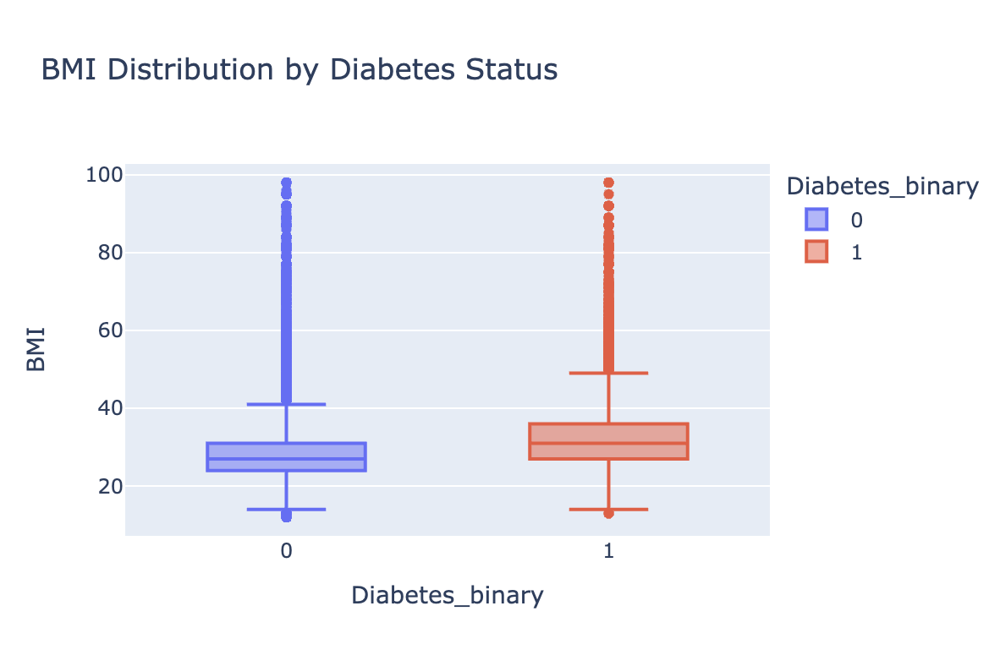
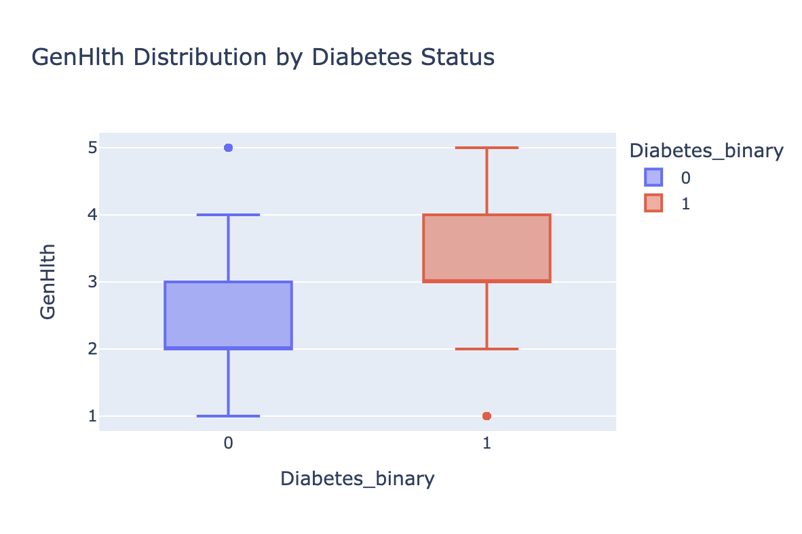
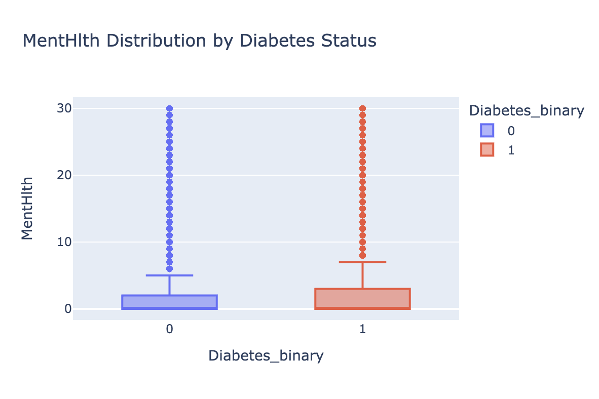
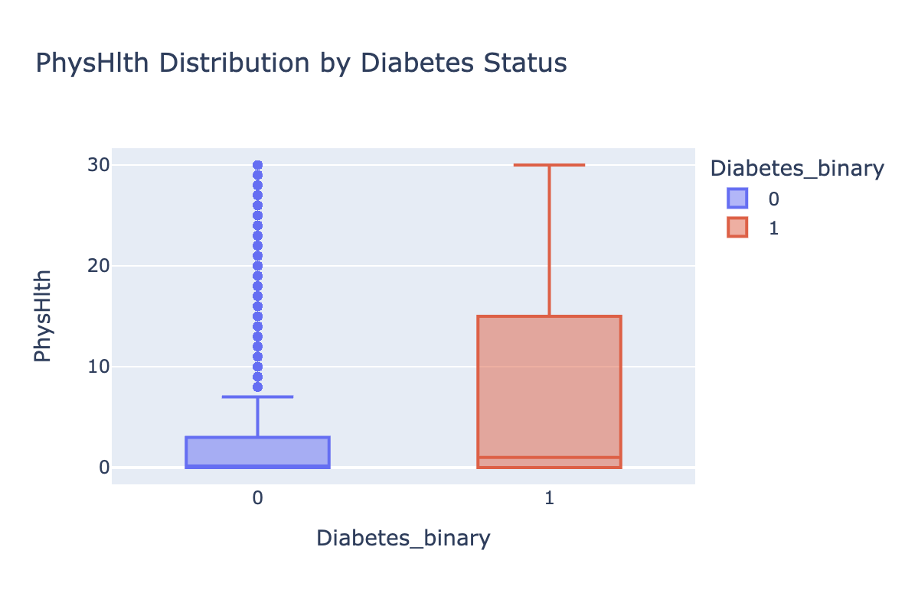

Analyzing these plots reveals some interesting information about the data. 

To start, the graph plotting `PhysHlth` shows that those who are labeled to have diabetes has a higher variance compared to those who don't have diabetes, with the 75th percentile reaching to 15 days amongst participants with diabetes. Meanwhile there seems to be a bunch of "outliers" in the other group, but it's because the 75th percentile amongst those without diabetes goes up to only 3 with its upper fence at 7, indicating that those without diabetes typically have significantly less poor physical health days.

The trend is similar amongst the `BMI` and `GenHlth` plots as the group with diabetes had a slightly higher distribution compared to the group without diabetes. This indicates that those with a higher BMI and lower perception of one's general health status are more prevalent amongst those with diabetes.

For `MentHlth` both groups have the same lower bound but the group with diabetes had a slightly wider spread, with the 75th quartile at 3 and an upper fence of 7. This means most points above 7 poor mental health days are considered abnormal based on the data.

Below shows a bar graph, plotting all available binary features and their risk difference (risk of diabetes with this feature - risk of diabetes without this feature)

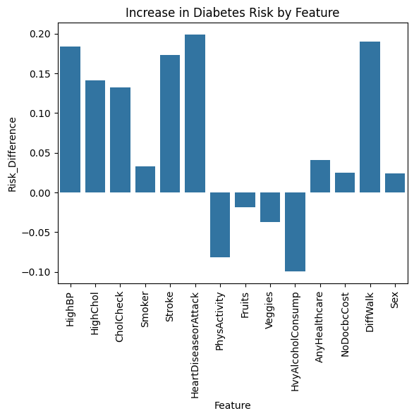

From the plot above, we can see that people with high blood pressure and high cholesterol both have around a 15-17% increased risk of getting diabetes. In terms of medical history and lifestyle, people who have had a heart disease, heart attack, and people who have difficulty walking all have around a 17-20% increased risk in getting diabetes. On the other hand, those who have participated in physical activity and those who don't consume heavy amounts of alcohol actually have around a 7-10% decreased risk in getting diabetes. This clearly shows that there are definitely some factors that contribute to the likelihood of an individual getting diabetes.

Below are the stacked bar charts for income, education, and general health features, plotting the proportion of diabetic and non-diabetic participants per feature value.

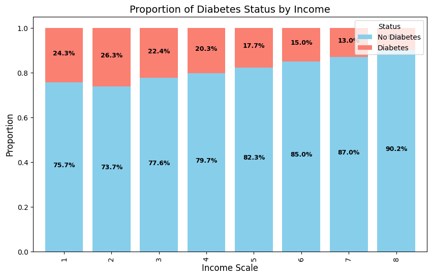
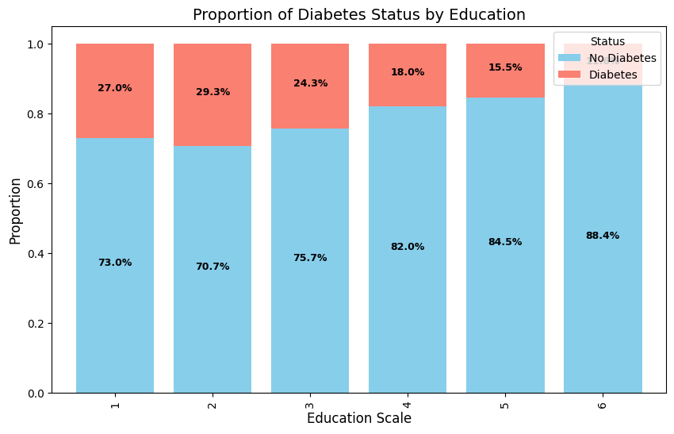
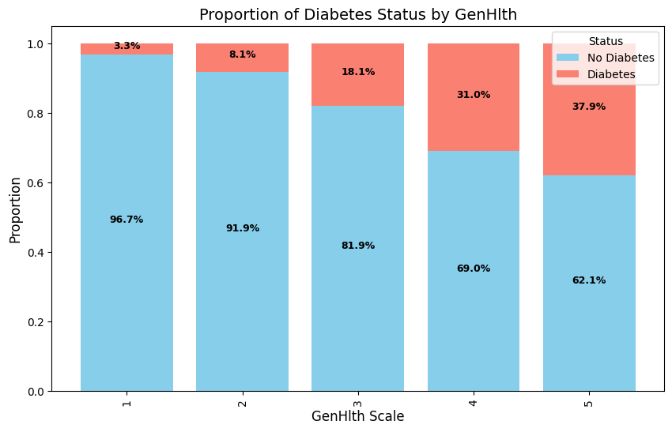

There are some clear trends when observing these plots. A larger proportion of those with a lower annual income seem to have diabetes. Similarly, those with less education also seem to have a larger proportion in which individuals have diabetes. This could be possibly due to the correlation between education and income. Individuals who have a lower income will more likely not have as much access to healthier foods, which are typically more expensive, as well as healthcare, which could allow people to monitor their health. For general health, as expected, there's a large proportion of people with diabetes who perceive their overall health to be poor, with 37.9% of participants who rated their general health as a 5 ended up having diabetes.

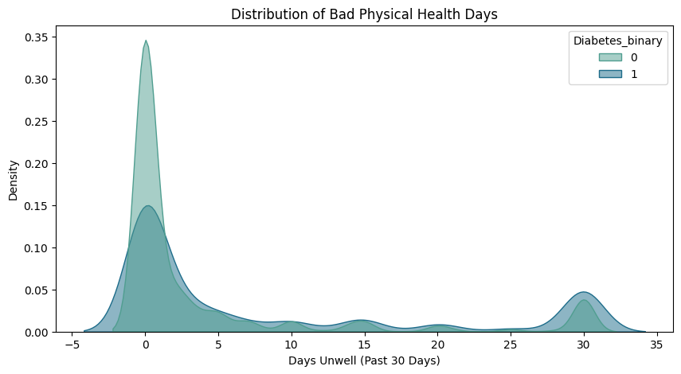
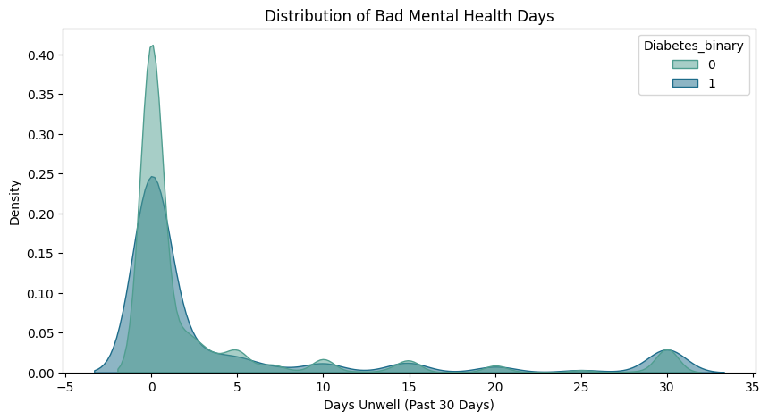
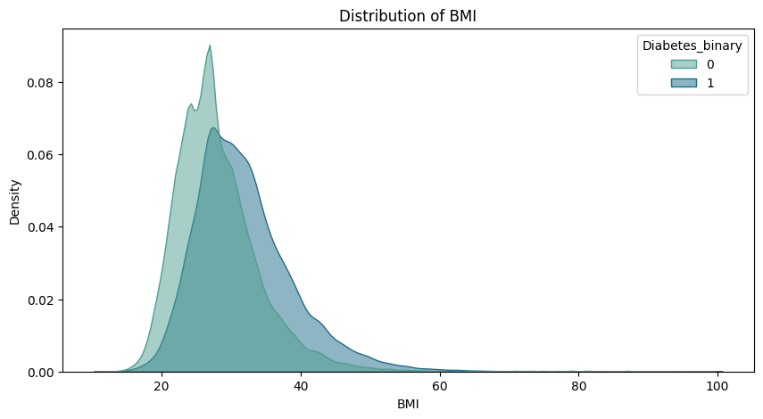

In terms of BMI, the graph plotting those who had diabetes is slightly shifted to the right compared to the graph plotting those who did not have diabetes. This shows that people with diabetes typically have higher BMIs than those who don't. When looking at the physical and mental health of participants, most people fall into the 0 (0 bad physical and mental days) or 30 (30 days of bad physical and mental days) category. In the plot, out of the people who had 0 bad physical and mental days, there were more people without diabetes compared to those who had it. The opposite is true when you look at those who had a full month's worth of bad physical and mental days.

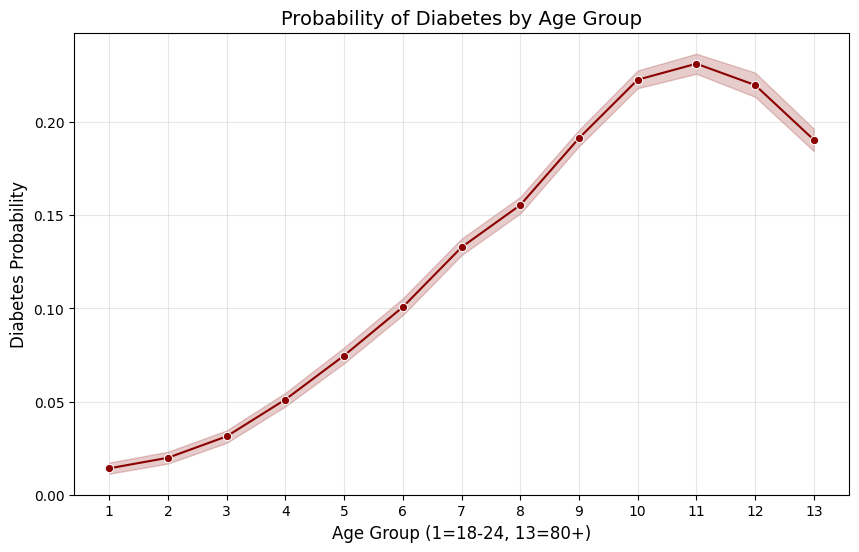

Finally, plotting the age feature, shown in the figure above, signifies that the probability of getting diabetes increases as people get older. There is a slight drop after the peak at the 11 group (participants ages 70-74). This is likely because people who have diabetes statistically tend to not live as long.

After visualizing the relationship between the features in this dataset with the target variable, as well as the correlation between the features themselves, it's clear that there are some patterns that can be utilized to determine whether a person probably has or is at risk of diabetes or not. 

## Data Preprocessing / Preparation

To process and prepare the data for future modeling, I first looked for any missing or duplicate data. As mentioned on the data source's website and through my analysis, it's confirmed that there are no missing data or duplicate samples in the dataset.

Before splitting the data into training and testing sets, I decided to feature engineer some new columns to help my models identify the patterns more easily. Using the correlation heatmap shown in the figure below and general domain knowledge, I created 4 new features that I believe would assist during training.

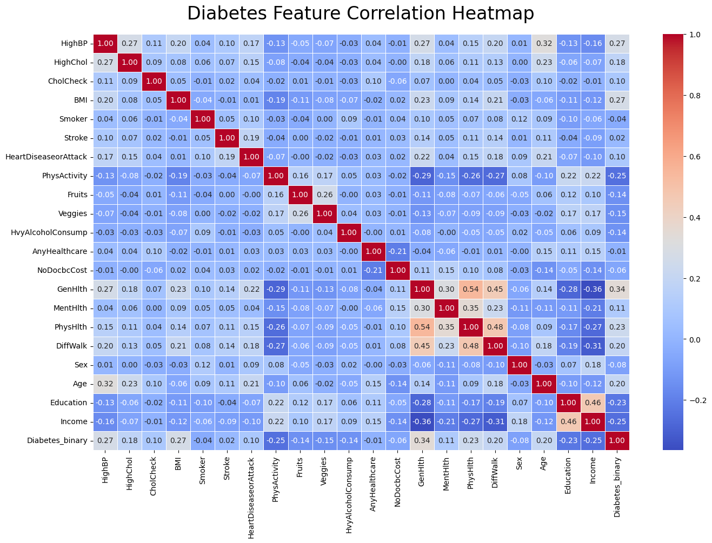

The first column is Total_Unhealthy_Days, which represents the total amount of an individual's mental and physical ill-being, combining the MentHlth and PhysHlth columns. The thought here is that the more mentally and physically stressed a person is, the higher likelihood of that person developing poor behavior and dietary habits, which in turn, can affect glucose and blood sugar levels [[3]](#3). Since poor physical health is known to increase risk of diabetes and poor mental health can lead to poor management of diabetes prevention measures, combining them would result in an even higher risk.

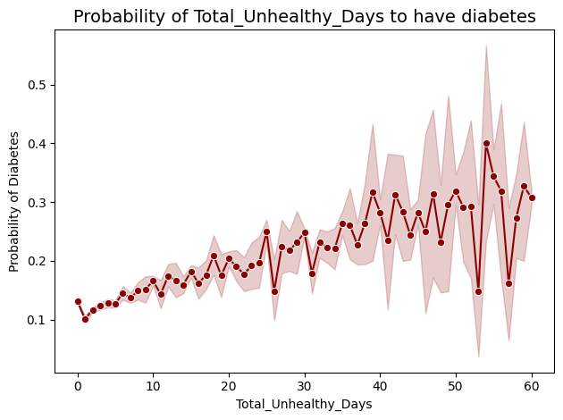

As seen in the figure above, although the line is jagged, there is an overall positive trend when it comes to diabetes probability. As a person encounters more unhealthy days, mental and/or physical, their risk of diabetes seems to slowly increase.

The second is Lifestyle_Risk, which measures lifestyle behaviors, like smoking habits and amount of physical activity, together to see if the combination of them can increase the risk of diabetes. If a person smokes and doesn't participate in any physical activity, they are subsequently increasing their insulin resistance and blood sugar levels, both of which are direct symptoms and causes of diabetes [[4]](#4).

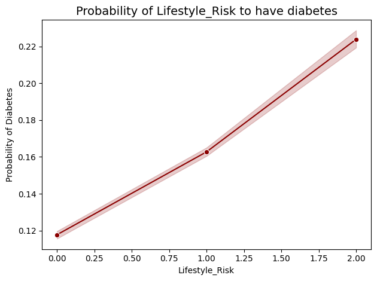

Similar to the Total Unhealthy Days plot, this trend also appears to increase if an individual exhibits one or both behaviors. However, this plot represents more of a linear trend, if a person participates in both smoking and exhibits a lack of physical activity, their risk of diabetes increases.

The third feature is Physical_Frailty, which, as described above, combines general health, difficulty walking, and physical health to encapsulate a person's frailty. Based on the heatmap, there is a fairly high correlation between these features. A person who is physically weaker has an increased risk due to the body's decreased metabolic functions, which consequently can lead to diabetes.

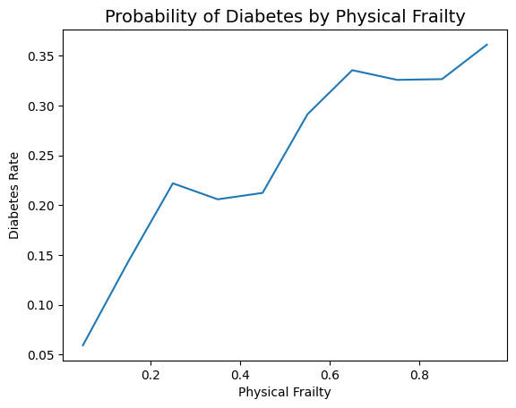

The left end of the spectrum represents individuals who have excellent general health, have no difficulty walking, and have had no bad physical health days. On the other end, the right end of the x-axis represents individuals who have poor general health, have difficulty walking, and have had 30 days of poor physical health. As depicted in the graph above, the more physically frail an individual is, the higher the risk of getting diabetes, going all the way up to around 60% increased risk.

The final feature is BMI_Inactive, which combines a person's BMI and the inverse of the PhysActivity feature. If a person's BMI is higher AND they aren't doing any physical activity to keep their bodily functions healthy, it's expected to increase the risk since the individual's overall health will most likely decrease as this behavior continues [[5]](#5).

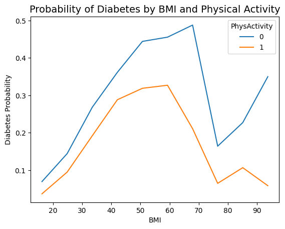

There seems to be a significant gap in the risk of getting diabetes between those who do physical activity and those who don't. The gap starts to increase as BMI increases, indicating that those who have a high BMI and those who don't do any physical activity have a significantly higher risk compared to those who do physical activity.

After developing some new features, I split the data into an 80-20 train-test split in order to give sufficient data for the models to train on, while still providing sufficient data for fine-tuning and testing.

I also standardized all the features using a standard scalar to prevent any scaled features like BMI to dominate the binary features. This scaled dataset will be used for models that require it, like Logistic Regression, while the unscaled dataset was kept for those that didn't require scaling, like Decision Trees.

Finally, I generated synthetic samples using SMOTE (Synthetic Minority Over-Sampling Technique), which creates artificial but representative samples to help balance the dataset classes. By applying SMOTE, it became possible to experiment with different models without the class imbalance heavily skewing the training and testing results. The table below showcases the class distribution before and after SMOTE. SMOTE was only applied to the training set rather than the entire dataset in order to prevent data leakage between training and test sets.

**Training Set Class Distribution:**
| Class | Before SMOTE | After SMOTE |
|-------|-------------:|------------:|
| 0 (Non-Diabetic) | 155,501 | 155,501 |
| 1 (Diabetic) | 28,078 | 125,090 |

## Modeling

Multiple classification algorithms were explored to compare predictive performance on this data. The selected models include linear, distance-based, tree-based, ensemble, and neural network approaches to evaluate how different learning strategies perform on diabetes prediction.

Logistic Regression was used due to its ability to test for linear separability between the data. It can easily provide class probabilities, which is great for classification. This serves as a good baseline model and a good general model to perform grid search on.

K-Nearest Neighbors is a good distance-based model, making classifications based on neighboring points. It's an intuitive model but it scales poorly with large datasets, which can make it an expensive model. Hopefully by running grid search to test out different values of k, we can find a pretty optimal value to get the highest precision, recall, f1-score, and roc-auc.

Decision Trees are good for making split decisions based on the data and works well with collinearity. It can possibly find features that help split the data into diabetic and non-diabetic groups.

Random Forest was tested because it had the same benefits as Decision Trees except they employ an ensemble of decision trees to learn about the data, each searching a randomly chosen subset of features to perform splits. This helps create generalized decision trees that, when put together, can create a final tree that generalizes the data and hopefully can output an accurate classification on diabetic status.

Gradient Boosting was used because it helps capture non-linear relationships pretty well and can easily handle different feature types. In addition, it requires minimum data preprocessing, meaning we don't need to scale the data.

Finally, MLP was used to test to see if a neural network can classify diabetic cases better than other models. It should be able to capture non-linear relationships and identify relationships and interactions between features automatically. Although, because MLP is sensitive to scaling, we will need to use the scaled data to train this model.

## Model Evaluation

Because there is a significant difference between false positives and false negatives in this binary classification problem, model performance was evaluated using F1-score and precision-recall metrics rather than accuracy alone. The primary objective of all models was to minimize false negatives (predicting a participant as non-diabetic when they are diabetic or at risk) while maximizing true positives (correctly predicting diabetic cases) and true negatives (correctly predicting non-diabetic cases). In addition, we also looked at the ROC-AUC to determine how well the model can separate the diabetic and the non-diabetic classes and was used to determine which model we could fine-tune to get a better performance.

### Baseline Model

The baseline model consisted of a logistic regression model with default parameters trained on the original dataset. Although the dataset included the engineered features, SMOTE was not applied at this stage, meaning the model was trained on the imbalanced data. The cross-validation score for this baseline model was approximately 0.8709.

After training, the classification report and confusion matrix produced the following results:

**Baseline Classification Report:**
| Diabetes? | Precision | Recall | F1-Score |
|-----------|----------:|-------:|---------:|
| 0 (No Diabetes) | 0.91 | 0.83 | 0.87 |
| 1 (Diabetes) | 0.36 | 0.52 | 0.42 |

**Baseline Confusion Matrix:**
| | Predicted: No Diabetes | Predicted: Diabetes |
|---|---:|---:|
| **Actual: No Diabetes** | 32,230 | 6,646 |
| **Actual: Diabetes** | 3,344 | 3,675 |

Based on the cross-validation score alone, the model appears to provide a strong starting point. However, further analysis of the classification report and confusion matrix reveals that the model still misses a considerable number of diabetic cases, failing to identify approximately 47.6\% of them. This means almost half of diabetic cases being incorrectly classified.

Additionally, the model incorrectly predicts diabetes for approximately 17.1\% of non-diabetic participants. While false positives are generally less severe than false negatives in this context, reducing both types of errors remains important for improving overall model reliability.

When training and evaluating models, the primary objective is to minimize false negatives, meaning maximize the model's recall, while also hopefully reducing false positives, in order to achieve the most reliable predictive performance possible. Overall, the goal is to train a model with a high recall and F1-score, which signifies that it's able to catch both positive and negative cases accurately.

### Testing Model Evaluations

The tables below show the evaluation metrics for all tested models for both the diabetic and non-diabetic cases.

**Model Classification Report for Diabetic Cases**
| Model | Precision | Recall | F1-Score |
|--------|----------:|-------:|---------:|
| Logistic Regression | 0.36 | 0.50 | 0.42 |
| KNN | 0.26 | 0.59 | 0.36 |
| Decision Tree | 0.27 | 0.38 | 0.32 |
| Random Forest | 0.34 | 0.38 | 0.36 |
| Gradient Boost | 0.35 | 0.55 | 0.43 |
| MLP | 0.33 | 0.59 | 0.43 |

**Model Classification Report for Non-Diabetic Cases**
| Model | Precision | Recall | F1-Score |
|--------|----------:|-------:|---------:|
| Logistic Regression | 0.90 | 0.84 | 0.87 |
| KNN | 0.90 | 0.70 | 0.79 |
| Decision Tree | 0.88 | 0.82 | 0.85 |
| Random Forest | 0.89 | 0.87 | 0.88 |
| Gradient Boost | 0.91 | 0.81 | 0.86 |
| MLP | 0.91 | 0.79 | 0.85 |

**Model ROC-AUC Values**
| Model | ROC-AUC |
|--------|--------:|
| Logistic Regression | 0.876 |
| KNN | 0.910 |
| Decision Tree | 0.866 |
| Random Forest | 0.952 |
| Gradient Boost | 0.891 |
| MLP | 0.892 |

Based on the classification report for both diabetic and non-diabetic cases, it seems like MLP performed better than the rest. However, when analyzing the ROC-AUC, the Random Forest performed significantly better than the rest with a score of 0.952. This signifies that the Random Forest model separated the two classes very well and there is some potential to fine-tune the predictive threshold to improve performance. Based on the cross-validation metrics in the tables above, the **MLP**, **Random Forest**, **Gradient Boost**, and **Logistic Regression** models were chosen for further evaluation due to either their high F1-scores or high ROC-AUC scores.

The following plots show the precision-recall curve and ROC curve for the selected models.

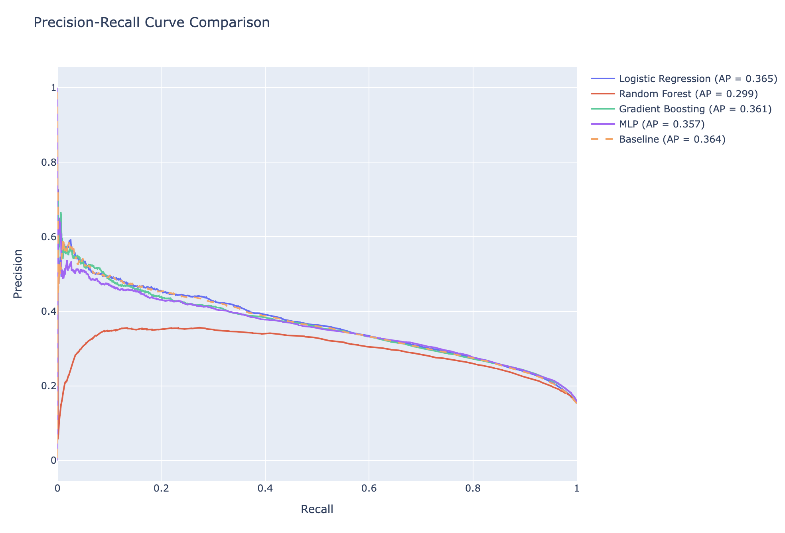

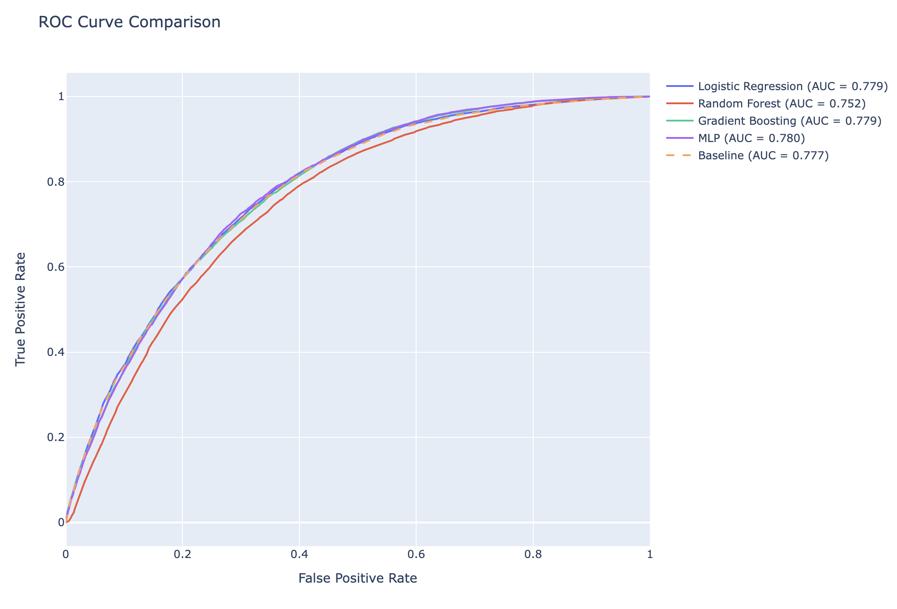

Although the cross-validation ROC-AUC was extremely high for Random Forest model, when tested against the test data, it actually performed noticeably worse than the other selected models, including the baseline model, indicating that this model might've been overfitting the data to get that high ROC-AUC value. The other 3 models were fairly close to each other in terms of precision-recall and ROC curve.

To find the best model, we calculated the F1-scores at all thresholds for each model and found the best threshold that yielded the best F1-score. The following test evaluation metrics based on this best threshold are shown below:

**Fine-Tuned Evaluation Metrics on Test Set for Diabetic Cases**
| Model | Best Threshold | Precision | Recall | F1-Score |
|--------|---------------:|----------:|-------:|---------:|
| MLP | 0.433263 | 0.316840 | 0.678729 | 0.432011 |
| Logistic Regression | 0.435820 | 0.334872 | 0.599516 | 0.429717 |
| Baseline | 0.456817 | 0.336272 | 0.592392 | 0.429014 |
| Gradient Boost | 0.461454 | 0.331717 | 0.604360 | 0.428333 |
| Random Forest | 0.329231 | 0.295488 | 0.657786 | 0.407790 |

The Multi-Layer Perceptron (MLP) model was chosen as the best model as it had the highest general performance, given by the F1-score and had the highest recall compared to the other models. This makes is more suitable for medical usage and screenings since it makes much fewer negative cases, where it incorrectly diagnoses someone as non-diabetic even though they actually have it. Because this model was the best and safest for medical professionals and individuals to utilize, the MLP model was chosen to be the final model.

With a recall score of around 0.678, it managed to catch around 67.8% of diabetic cases, which is around a 14.57% increase in performance compared to the baseline model, which exceeds our original goal of a 5-10% increase from the baseline model. According to the confusion matrix in the figure below, it showed 4,764 true positives (correctly identified diabetic case) and 2,255 false negatives (failed to identify diabetic case), indicating that the model could identify a significant amount of diabetic individuals while keeping the missed cases fairly low. Overall, compared to the baseline model, the MLP model significantly improved diabetic detection in individuals, which is incredibly important for medical use cases, both for doctors and individuals who are concerned about their risk. Although the model produced a decent amount of false positives, 10,272 cases, this is much less concerning and would only warrant some extra screenings for more confirmation.

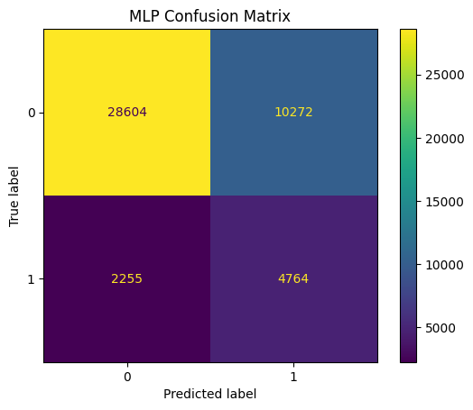

When analyzing the feature importance of the model, shown in the figure below, permutation importance was used to estimate the contribution of individual features to visualize the reasoning behind the model's predictive performance. Features with a higher value mean that there is a higher change in performance when that feature is shuffled. According to the graph, **Physical Frailty** was the most important feature by a decent amount, at just above 0.4. This feature combined self-reported general health, difficulty walking, and number of physically unhealthy days, which suggests that overall physicall health is strongly associated with diabetes risk. Next is **Total Unhealthy Days**, which combines number of unhealthy physical and mental days, and the health metrics, **PhysHlth, GenHlth, MentHlth**, following shortly after.

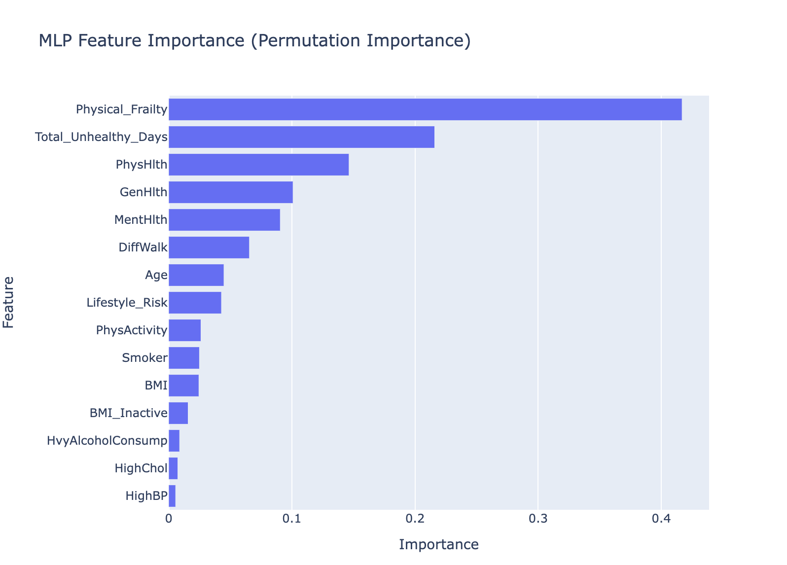

This is a very interesting case as features that are typically known to cause higher risk of diabetes like **HighBP**, **HighChol**, and **BMI** are ranked almost last. This could be because our engineered feature had captured most of the predictive information that were contained within those features. This could've caused the individual features to make less of an impact, since permutation importance measures the contribution of a single feature against all others.

These findings suggest that a person's health status contribute significantly towards the risk of getting diabetes. It also shows that when combining these health statuses, we can create features that have even greater predictive power than each individual health status feature alone.

## Conclusion

### Model Deployment, Monitoring & Maintenance

This final MLP model could be deployed either as a medical tool for doctors to help quickly diagnose patients for diabetes or, since it contains some self-reported metrics, it could be integrated in a downloadable health application where users can quickly fill out a survey describing their current healths and get a verdict as to whether they might have diabetes or not. This model can be saved and sent to a production environment using JobLib or Pickle. A REST API endpoint can be developed and integrated into health applications to help both users and medical professionals, as explained before.

Once this model has been deployed, it should be monitored whilst in production. Data drift is a notable concern as the metrics of incoming individuals can change and differ from those taken during training. This would require scheduled retraining periods, where we take in the new data and use that to retrain and improve our model with the current population. Refraining from doing this could cause the model's performance to drop over time due to changing data over time.

In addition performance metrics such as precision, recall, F1-score, and ROC-AUC should also be tracked in order to make verify whether the model is still performing well against new data, if not, then we must retrain the model to ensure optimal performance.

To do this monitoring and maintenance, we can use MLflow or Data Version Control (DVC) to maintain the model's version history, as well as track model updates, training datasets, and performance metrics. This would also allow us to set up a retraining schedule for continuous improvements.

### Scalability

As this model gets used over time, scalability will start to become a problem. Since the model we'd be deploying is an MLP model, large-scale deployment should not be a problem since generating a prediction doesn't take that much computing power. However, when it comes to retraining the model with possibly millions of new data samples, it becomes computationally expensive to retrain compared to other models.

To mitigate this problem, we could schedule the retraining process to occur less frequently so there's less overhead while still allowing the model to adapt to the changing population. If frequent retraining is needed due to a significant influx of new data, we could use a cloud-based distributed computing resource or GPU acceleration to drastically reduce training time. In addition, to assist with scalability and outreach, we can deploy this system onto multiple instances behind a load balancer. Although, since this is an MLP model, there should be no problem in terms of prediction efficiency since inference / prediction is computationally inexpensive compared to the training process.

### Improvement

To improve this model, we could start by adding more measurable features such as A1C levels, Fasting Plasma Glucose (FPG) levels, and Oral Glucose Tolerance Tests (OGTT), which can sometimes gurantee that the individual has diabetes [[6]](#6). Currently, the dataset has a fair amount of self-reported features such as **GenHlth**, **PhysHlth**, and **MentHlth**, which can be subjective and susceptible to bias--it depends on the individual. In addition to adding more features, we could find and use larger, more recent datasets to make sure our model has more data to train on and that it's keeping up with current data to prevent model decay.

Finally, another spot for improvement would be the model choice. In the future, we could explore other models such as XGBoost and ensemble methods that helps combine the predictions from individual models within the ensemble. This can help improve generalization while still providing strict and decisive boundaries.

## References
<a id="1">[1]</a> International Diabetes Federation, “Idf diabetes atlas,” 2021, accessed: 2026-05-30. [Online]. Available: https://idf.org/about-diabetes/diabetes-facts-figures/

<a id="2">[2]</a> Centers for Disease Control and Prevention, “Cdc diabetes health indicators,” 2017. [Online]. Available: https://doi.org/10.24432/C53919

<a id="3">[3]</a> Centers for Disease Control and Prevention, "Diabetes and mental health,” n.d., accessed: 2026-05-30. [Online]. Available: https://www.cdc.gov/diabetes/living-with/mental-health.html

<a id="4">[4]</a> American Heart Association, “Understand your risk for diabetes,” n.d., accessed: 2026-05-30. [Online]. Available: https://www.heart.org/en/health-topics/diabetes/understand-your-risk-for-diabetes

<a id="5">[5]</a> National Institute of Diabetes and Digestive and Kidney Diseases, “Risk factors for type
2 diabetes,” n.d., accessed: 2026-05-30. [Online]. Available: https://www.niddk.nih.gov/health-information/diabetes/overview/risk-factors-type-2-diabetes

<a id="6">[6]</a> American Diabetes Association, “Diabetes diagnosis,” n.d., accessed: 2026-05-30. [Online]. Available:
https://diabetes.org/about-diabetes/diagnosis

## Contact

Thank you for taking the time to review this project.

If you have any questions and/or feedback, feel free to connect with me:

- **Justin Tran**
- **Email:** jr.tran79@gmail.com
- **LinkedIn:** https://www.linkedin.com/in/justin-tran9/
- **GitHub:** https://github.com/Jussttin9
